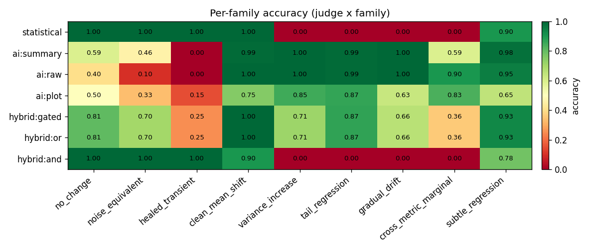

# canaryLLM

A Docker Compose harness that runs a complete automated canary analysis (ACA)
pipeline three ways and scores the results against ground truth. The three judges
are the industry-standard statistical test, a configurable AI judge (an LLM or a
vision model), and a hybrid of the two.

The point of the exercise is narrow and testable: the statistical judge that ships
with Spinnaker/Kayenta has a known structural blind spot, an AI judge that reads the
whole distribution can cover it, and a hybrid can keep the statistical judge's
precision while recovering the recall the AI adds. This repo measures how often that
matters, on a labelled synthetic dataset, and writes the numbers to `results/`.

Everything runs locally on open-weight models through Ollama. The same judge code
can be pointed at AWS Bedrock, OpenAI, or Anthropic by editing a config file; no
code changes.

## Contents

- [What automated canary analysis is](#what-automated-canary-analysis-is)
- [The three judges](#the-three-judges)
- [Results](#results)
- [Requirements](#requirements)
- [Quick start](#quick-start)
- [Command reference](#command-reference)
- [Architecture](#architecture)
- [The AI judge](#the-ai-judge)
- [The hybrid judge](#the-hybrid-judge)
- [The evaluation dataset](#the-evaluation-dataset)
- [Configuring the statistical judge fairly](#configuring-the-statistical-judge-fairly)
- [Running the experiment and reading `results/`](#running-the-experiment-and-reading-results)
- [The stress test](#the-stress-test)
- [Bringing your own model or provider](#bringing-your-own-model-or-provider)
- [Reading a single result](#reading-a-single-result)
- [Viewing a result in Referee](#viewing-a-result-in-referee)
- [Configuration reference](#configuration-reference)
- [Build notes and things learned the hard way](#build-notes-and-things-learned-the-hard-way)
- [Repository layout](#repository-layout)
- [Scope and limitations](#scope-and-limitations)
- [Reproducing the published numbers](#reproducing-the-published-numbers)
- [License](#license)

## What automated canary analysis is

Automated canary analysis is how a continuous-delivery system decides whether a new
build is safe to promote. Route a slice of traffic to the new version (the canary,
or experiment), keep the rest on the current version (the baseline, or control),
measure both with the same metrics, and hand the two sets of measurements to a judge.
The judge returns a score and a verdict, and the verdict gates promote-versus-roll-back.

The de-facto standard judge is Spinnaker/Kayenta's `NetflixACAJudge`. It compares the
two series with a Mann–Whitney U rank test, which tests for a shift in the median
(the location) of the distribution. Two consequences fall straight out of that
choice: the test is blind to a change in variance, and it is blind to temporal order.
Both are documented upstream in
[spinnaker/spinnaker#6278](https://github.com/spinnaker/spinnaker/issues/6278) and
visible in the Kayenta source (`MannWhitneyClassifier.scala`). The per-metric knobs
that operators reach for (`direction`, `effectSize`, critical thresholds) only tune
how a median shift is graded; none of them help when the median has not moved.

That blind spot is the thing this harness measures.

## The three judges

All three run as real Kayenta analyses and are chosen entirely by canary config. One
judge service plays every role:

| Judge | `judge.name` | How it works |
|---|---|---|
| Statistical | `NetflixACAJudge-v1.0` | Kayenta's built-in Mann–Whitney judge, in-process. Not reimplemented. |
| AI | `RemoteJudge-v1.0` | Kayenta forwards the metric pairs to `judge-service`, which builds a representation (`summary`, `raw`, or `plot`), calls one OpenAI-compatible gateway (LiteLLM in front of Ollama / Bedrock / OpenAI / Anthropic), and returns a verdict. A no-op `dummy` mode is the model-free default. |
| Hybrid | `RemoteJudge-v1.0` (`mode=hybrid`) | The service calls back into Kayenta to run the genuine `NetflixACAJudge` on the same pairs, computes its own AI verdict, and merges the two under a selectable policy (`gated`, `or`, or `and`). |

The AI judge never branches on the provider. Provider selection lives in
`litellm/config.yaml`; the judge only branches on modality (text versus vision).

## Results

The scored experiment runs every judge across a labelled nine-family dataset and
every model present on the machine. The numbers below come from a 180-scenario run
(9 families × 20 instances) across the eight open-weight local models
[listed later](#models-evaluated).

The statistical judge is precise and structurally blind. Accuracy 0.54, precision
1.00, recall 0.32. It is correct on every benign family and on clean mean shifts, and
it scores zero on all four blind-spot families (variance increase, tail/p99
regression, gradual drift, and cross-metric marginal degradation). That is exactly
what the rank-test theory predicts.

The AI judges catch the blind spots but over-fire on benign noise. Per-family accuracy
on the four blind-spot families is 0.80–0.97, with the `summary` and `raw` text
representations doing best. They pay for it with false positives on benign
high-variance canaries and on canaries that already recovered from a transient, so
overall accuracy lands between 0.59 and 0.83. The single best standalone
configuration is `ai:summary` with `phi4`, at accuracy 0.83 and F1 0.89.

The gated hybrid keeps precision and recovers recall. It trusts the statistical
judge's failures (which are high precision) and escalates to the AI only in the cases
where the statistical judge is weak. Its clearest effect is on the weaker models: it
lifts moondream's precision from 0.71 to 0.92 and granite's from 0.67 to 1.00 while
keeping recall on the blind spots. McNemar's exact test finds the improvement over the
statistical judge significant for seven of the eight models (for example phi4
p ≈ 3e-5, granite p ≈ 2e-5, moondream p ≈ 4e-5, deepseek p ≈ 0.0002, mistral
p ≈ 0.0001). The `and` policy collapses back to statistical-like behaviour, which is
the point: the combination rule is what matters, not the fact that two judges are
involved.

Per-family accuracy, averaged over models:

| judge | no_change | noise_equiv | healed_transient | clean_mean_shift | variance_increase | tail_regression | gradual_drift | cross_metric | subtle_regression |
|---|---|---|---|---|---|---|---|---|---|
| statistical | 1.00 | 1.00 | 1.00 | 1.00 | 0.00 | 0.00 | 0.00 | 0.00 | 0.90 |
| ai:summary | 0.59 | 0.46 | 0.00 | 0.99 | 1.00 | 0.99 | 1.00 | 0.59 | 0.98 |
| ai:raw | 0.40 | 0.10 | 0.00 | 1.00 | 1.00 | 0.99 | 1.00 | 0.90 | 0.95 |
| ai:plot | 0.50 | 0.33 | 0.15 | 0.75 | 0.85 | 0.87 | 0.63 | 0.83 | 0.65 |
| hybrid:gated | 0.81 | 0.70 | 0.25 | 1.00 | 0.71 | 0.87 | 0.66 | 0.36 | 0.93 |
| hybrid:and | 1.00 | 1.00 | 1.00 | 0.90 | 0.00 | 0.00 | 0.00 | 0.00 | 0.78 |



The statistical row is zero on exactly the four blind-spot families and near-perfect
everywhere else. The AI rows invert that: strong on the blind spots, weaker on the
benign families where they false-positive. The gated hybrid sits between them.

### What changed from N=5 to N=20

The same experiment was run at two sizes with an identical prompt, seed, and
statistical config: 45 scenarios (kept in `reference-results/n5/`) and 180 scenarios
(in `reference-results/n20/`). Comparing them separates the robust findings from
small-sample noise.

| | N=5 (45 scenarios) | N=20 (180 scenarios) | reading |
|---|---|---|---|
| statistical accuracy | 0.556 | 0.544 | stable; blind families 0.00 at both sizes |
| best standalone AI | `ai:raw` / mistral 0.80 | `ai:summary` / phi4 0.83 | the strongest LLM separates out with more data |
| `hybrid:gated` + moondream | 0.822 (prec 1.00) | 0.683 (prec 0.92) | the N=5 peak was partly luck; it regresses to the mean |
| McNemar statistical vs hybrid:gated, p<0.05 | 2 / 8 models | 7 / 8 models | larger N buys statistical power |

Three things to take from that:

1. The structural findings do not move. The statistical judge is 0% on the four
   blind-spot families and roughly 100% on the benign and clean families at both
   sizes. That is a property of the rank test, not of the sample.
2. Bigger N buys significance, not a different story. At N=5 the gated hybrid already
   beat the statistical judge, but there were too few discordant pairs for McNemar to
   confirm it beyond 2 of 8 models. At N=20 the same advantage is significant for 7 of
   8.
3. Per-config rankings settle down. A lucky small-N peak (moondream's gated hybrid at
   0.82) regresses toward 0.68, while the genuinely strongest config (phi4 with
   `summary`) rises and holds. Treat single N=5 cells as indicative and trust the N=20
   averages.

The tables and figures are regenerated into `results/` by `make experiment`. The
models scored were `qwen2.5:7b`, `phi4`, `olmo2:7b`, `mistral-nemo:12b`,
`deepseek-r1:7b`, `moondream:v2`, `granite3.2-vision`, and `minicpm-v`.

> These are laptop-scale models, roughly 2–14B parameters. Larger or cloud models
> tighten the AI's per-metric labels and reduce its benign-family false positives.
> The harness runs those too, by config; see
> [bringing your own model or provider](#bringing-your-own-model-or-provider).

## Requirements

- Docker with Compose v2 (`docker compose`), and `make`.
- Python 3.11 on the host (the `make` targets build a `.venv` from
  `tools/requirements.txt`).
- Roughly 6 GB of RAM free for the stack, plus disk for whatever models you pull.
- Ollama, only if you want to run the real AI judges. It runs on the host, not in
  Compose.
- Tested on macOS (Apple Silicon) and Linux (amd64).

## Quick start

```bash
cp .env.example .env        # the defaults are fine for local use
make validate               # brings the stack up and runs the model-free regression
```

`make validate` is the functional gate. It starts the stack, waits for Kayenta to
report healthy, seeds a small dataset, and runs the statistical, dummy-AI, and hybrid
judges end to end. It exits 0 only if all three return a verdict, and it never needs a
model.

To exercise the real AI judges and the scored experiment, run some models locally with
Ollama:

```bash
brew install ollama
OLLAMA_HOST=0.0.0.0:11434 ollama serve &            # bind 0.0.0.0 so the containers can reach it
ollama pull qwen2.5:7b && ollama pull moondream:v2  # plus any others you want scored
make up                                             # (re)build and start the full stack
make validate-ai                                    # sanity-check each model present
make experiment-quick                               # a small smoke run of the experiment
make experiment                                     # the full scored experiment -> results/
```

The harness scores whatever models are present locally and skips the rest. Nothing is
mandatory beyond the models you choose to pull.

## Command reference

| Command | What it does | Needs a model? |
|---|---|---|
| `make validate` | Regression gate: up, seed, and the three judges (statistical, dummy-AI, hybrid). | No |
| `make validate-ai` | Sweep over the models present locally; assert each returns a valid verdict. | Yes (the pulled ones) |
| `make seed-eval` | Seed the labelled nine-family dataset into VictoriaMetrics and write the manifest. `--probe` runs the genuine `NetflixACAJudge` per family. | No |
| `make experiment` | The full scored experiment: every judge × every scenario × every present model, into `results/`. Absent models are skipped. | Yes |
| `make experiment-quick` | Smoke run of the experiment (n=1, two default models). | Yes |
| `make scenario` | Run the blind-spot stress test through all judges, with Referee links. | Yes |
| `make demo-dummy` | The three judges over the dummy dataset, standalone. Prints Referee links. | No |
| `make results` | Table of the latest recorded Kayenta result per judge (verdict, score, model, Referee link). | No |
| `make referee [JUDGE=<key>] [EXEC=<id>]` | Open a recorded report in Referee. | No |
| `make test-judge-mock` | AI judge with the model stubbed; asserts a valid result (parsing and mapping). | No |
| `make up` / `make ensure-up` | Start the stack (force rebuild / build only what is missing). | No |
| `make seed` / `make logs` / `make ps` / `make down` / `make clean` | Seed dummy data / tail logs / status / stop / stop and wipe volumes. | No |

You can override the experiment size with environment variables: `EVAL_N` (instances
per family, default 12), `EVAL_SEED` (master seed), and `EVAL_MODELS` (a comma-separated
allow-list). The host tools run in a local `.venv` that `make` creates for you.

## Architecture

Seven Compose services share one Docker bridge network (`canary-net`) and address each
other by service name. Host ports are published so that you, and the host-run tools,
can reach them. Ollama runs on the host rather than in Compose, because the
Apple-Silicon Metal GPU is not reachable from inside a container; LiteLLM reaches it at
`host.docker.internal:11434`.

| Service | Image or build | Host port | Role |
|---|---|---|---|
| `redis` | `redis:7-alpine` | 6379 | Backs Kayenta's embedded Orca |
| `minio` (+ `minio-init`) | `minio/minio` | 9000 / 9001 | S3 object store (configs, results) |
| `victoriametrics` | `victoriametrics/victoria-metrics` | 8428 | Metric store (Prometheus API, back-dated writes) |
| `kayenta` | `armory/kayenta:2.36.9` | 8090 | The ACA engine (standalone, no Spinnaker) |
| `judge-service` | build `./judge-service` | 5001 | The configurable remote judge (FastAPI) |
| `litellm` | `ghcr.io/berriai/litellm` | 4000 | One OpenAI-compatible gateway for every provider |
| `referee` | build `./referee` | 3001 | Kayenta UI, built from source |
| Ollama (host, not Compose) | `brew install ollama` | 11434 | Local model runner; needed only for the AI modes |

```
                       ┌─────────────────────────── host ───────────────────────────┐
  you / browser ──▶ Referee UI :3001 ──proxy /kayenta/*──▶                            │
                                                          │                            │
  host tools (.venv):                                     ▼                            │
   seed_*_data.py / seed_eval_dataset.py ─▶ VictoriaMetrics :8428 ◀──fetch metrics──┐  │
   run_pipeline / run_scenario ──▶ Kayenta :8090 ───────────────────────────────┐  │  │
   run_experiment.py ──▶ Kayenta /judges/judge + judge-service /judge            │  │  │
                                                                                 │  │  │
   ┌───────────────────────────── canary-net (compose) ──────────────────────┐  │  │  │
   │  Kayenta ──Orca queue──▶ Redis :6379                                      │  │  │  │
   │  Kayenta ──configs/results (S3)──▶ MinIO :9000                            │◀─┘  │  │
   │  Kayenta ──PromQL──▶ VictoriaMetrics :8428 ──────────────────────────────┼─────┘  │
   │  Kayenta ──POST /judge──▶ judge-service :5000                             │        │
   │      judge-service ──(hybrid) callback /metricSetPairList,/canaryConfig,  │        │
   │                       /judges/judge──▶ Kayenta :8090                      │        │
   │      judge-service ──(AI modes) POST /v1/chat/completions──▶ litellm :4000│        │
   │  litellm ──OpenAI-compat──▶ Ollama (host) :11434  /  Bedrock·OpenAI·Anthropic ─────┘
   └──────────────────────────────────────────────────────────────────────────┘
```

> A note on the judge-service port. It is published on host **5001**, not 5000,
> because macOS Control Center (AirPlay Receiver) binds 5000. Kayenta reaches the
> service in-network at `judge-service:5000` regardless. Change `JUDGE_SERVICE_PORT`
> in `.env` if 5001 is taken too.

Useful URLs once the stack is up:

- Kayenta health: <http://localhost:8090/health> · Swagger: <http://localhost:8090/swagger-ui/index.html>
- VictoriaMetrics: <http://localhost:8428/>
- judge-service health: <http://localhost:5001/health>
- LiteLLM gateway: <http://localhost:4000/v1/models>
- Referee UI: <http://localhost:3001/>
- MinIO console: <http://localhost:9001/>

## The AI judge

The AI judge is a single code path for every model and provider. Two things are pure
configuration.

The **representation** (`mode`) decides how the metrics are shown to the model:

- `summary`: per-metric descriptive statistics (`n`, mean, median, p90/p95/p99,
  stddev, min, max, slope, and the experiment-minus-control deltas);
- `raw`: the value arrays themselves, as text;
- `plot`: a rendered matplotlib chart with control and experiment overlaid, attached as
  an image for a vision model. The text summary rides along too.

The **model** is a registry alias such as `qwen-llm` or `moondream-vlm`. Switching
models, or switching between text and vision, is a one-line config change.

### Flow

```
Kayenta ──POST /judge {canaryConfig, metricSetPairList, scoreThresholds}──▶ judge-service
   reads judge.judgeConfigurations.mode + model (env fallbacks JUDGE_MODE / JUDGE_MODEL)
   builds the representation (summary/raw text, or a matplotlib PNG for plot)
   one OpenAI-compatible call ──▶ litellm ──▶ Ollama (host) / Bedrock / OpenAI / Anthropic
   strict-JSON verdict ──▶ parsed and mapped to a valid CanaryJudgeResult
```

### The prompt is frozen

The prompt is frozen at `PROMPT_VERSION = "v1-frozen-2026-06"` (in
`judge-service/app/llm_judge.py`) and was deliberately not tuned against the scenario
outcomes. Tuning it would overfit to the statistical judge's known weaknesses and make
the comparison meaningless. It is one fixed template for every model and every
representation. A system message sets the role; the user message is the representation
plus a strict-JSON verdict instruction that asks the model to judge holistically, to
weigh variance and instability, the tail (p90/p95/p99/max), and emerging trends
(slope), not just the mean and median. The ground-truth label never appears in the
prompt, control is always presented before experiment (to control for position bias),
and the rationale is length-bounded (to control for verbosity bias).

### Determinism and robustness

Calls use `temperature=0`, fixed `top_p` and `max_tokens`, a `seed` where the backend
supports one, and structured JSON output. The parser is built to tolerate what real
models actually emit: it strips reasoning `<think>…</think>` preambles (deepseek-r1
does this) and markdown code fences, extracts the first balanced JSON object, retries
once, and on a final failure returns a valid `CanaryJudgeResult` with an explicit
error classification. No run ever crashes the analysis or returns a raw error. The
experiment includes a determinism preflight that runs one scenario twice and asserts
an identical verdict. Every AI call is logged to `data/ai-logs/`: the prompt, the chart
PNG and its sha256, the raw response, the parsed verdict, and the resolved model.

### Models evaluated

The evaluated set is open-weight (Apache-2.0, MIT, or fully open) and served locally by
Ollama. Aliases are registered in `judge-service/models.yaml` (for modality) and
`litellm/config.yaml` (for provider and tag).

| Alias | Model | Modality | License |
|---|---|---|---|
| `qwen-llm` | Qwen2.5 7B Instruct | text | Apache-2.0 |
| `phi4-llm` | Phi-4 14B | text | MIT |
| `olmo2-llm` | OLMo 2 7B | text | Apache-2.0 (fully open) |
| `mistral-nemo-llm` | Mistral-Nemo 12B | text | Apache-2.0 |
| `deepseek-r1-llm` | DeepSeek-R1-Distill-Qwen 7B | text | MIT |
| `moondream-vlm` | Moondream2 (~1.8B) | vision | Apache-2.0 |
| `granite-vision-vlm` | Granite 3.2 Vision 2B | vision | Apache-2.0 |
| `minicpm-v-vlm` | MiniCPM-V 8B | vision | (vision) |

Any alias whose Ollama tag is not pulled is skipped automatically. Text models use
LiteLLM's `ollama_chat/` provider; vision models use `ollama/`, which converts the
OpenAI `image_url` parts into Ollama's `images` field.

## The hybrid judge

The hybrid is not a reimplementation of either judge. When Kayenta calls
`judge-service` for a `mode=hybrid` analysis, the service:

1. computes its own AI verdict on the received pairs (the no-op dummy by default, or a
   real model if `aiMode=summary|raw|plot` is set);
2. calls back into Kayenta (`POST /metricSetPairList`, `POST /canaryConfig` with
   `judge.name=NetflixACAJudge-v1.0`, then `POST /judges/judge`) to run the genuine
   statistical judge on the same already-fetched pairs. No metric is re-fetched and
   there is no recursion, because the temporary config names an in-process judge;
3. merges the two verdicts under a selectable policy and returns one
   `CanaryJudgeResult`. The hybrid is itself a normal Kayenta analysis with its own
   execution id, so it renders in Referee like any other.

The merge policy lives in `judge-service/app/hybrid_policy.py` as a pure
`decide_policy()` function, and the experiment runner imports the same function, so the
scored hybrid is identical to what the service returns. Select a policy with
`judgeConfigurations.hybridPolicy`:

- `gated` (the default, and the recommended one): trust statistical failures, since
  they are high precision. On a clean statistical pass, escalate to the AI only when it
  fails with high confidence or cites a blind-spot dimension (variance, tail, or trend)
  in its reasoning. In the statistical judge's marginal, near-threshold regime, where
  it is least reliable, defer to the AI. This is the policy that delivers
  statistical-like precision with AI-like recall on the blind spots.
- `or`: fail if either judge fails. A safety net with high recall, but it inherits the
  AI's benign-family false positives.
- `and`: fail only if both judges fail. Strict, high precision, low recall.

The policy parameters (the marginal band around the threshold, the AI fail-confidence
cutoff, and the blind-spot keyword set) have documented defaults in `hybrid_policy.py`.
The returned score is always set so that its threshold mapping agrees with the verdict,
because Kayenta re-derives promote-versus-roll-back from the score.

## The evaluation dataset

`tools/eval_dataset.py` generates, deterministically from one master seed, N instances
per family. Each instance is a control-and-experiment pair of series for one to three
metrics over a 30-minute window at 60-second resolution, written to VictoriaMetrics
with the framework's `Canary="Control"` / `Canary="Experiment"` scheme. Instances are
isolated by namespacing the metric names with an opaque global id (for example
`http_request_duration_seconds_g0007`), never the family name, so the ground truth
never leaks into what the model sees. `data/eval_manifest.json` records, per scenario:
id, family, seed, parameters, ground-truth verdict, and per-metric truth.
`data/eval-configs/` holds the generated per-scenario configs.

| Family | Truth | What it probes | Statistical behaviour |
|---|---|---|---|
| `no_change` | PASS | baseline ≈ experiment, mild noise | correct PASS |
| `noise_equivalent` | PASS | both high-variance, same distribution | correct PASS (no location shift) |
| `healed_transient` | PASS | degraded early, then recovers | correct PASS (median robust to a transient) |
| `clean_mean_shift` | FAIL | median clearly worse | correct FAIL (its home turf) |
| `variance_increase` | FAIL | equal median, much higher variance | blind, false PASS |
| `tail_regression` | FAIL | mean/median flat, p95/p99 worse | blind, false PASS |
| `gradual_drift` | FAIL | late, progressive ramp worse | blind, false PASS (order-insensitive) |
| `cross_metric_marginal` | FAIL | several metrics each in tolerance, jointly degraded | blind, false PASS (group dilution) |
| `subtle_regression` | FAIL | small real shift near tolerance | correct FAIL (AI false-negative risk) |

The "blind" rows were confirmed against the genuine `NetflixACAJudge` by the
`make seed-eval --probe` step. The dataset deliberately includes genuine PASS families
so the FAIL numbers mean something: a judge that always says FAIL is penalised on
`no_change`, `noise_equivalent`, and `healed_transient`.

## Configuring the statistical judge fairly

For the comparison to be honest, the statistical judge has to run at its best, so any
shortfall is a real structural blind spot and not a misconfiguration. One consistent,
best-practice config is applied to every metric in every scenario, with no
per-scenario hand-tuning. Each choice was checked against the Kayenta source
(`NetflixACAJudge.scala`, `MannWhitneyClassifier.scala`, `EffectSizes.scala`,
`WeightedSumScorer.scala`).

| Setting | Value | Why |
|---|---|---|
| `direction` | `increase` | every metric here is "higher is worse" |
| `effectSize.measure` | `meanRatio` | Kayenta default; thresholds are `experimentMean / controlMean` |
| `effectSize.allowedIncrease` | `1.05` | a sensitive 5% gate; best recall on clean shifts without flagging benign noise |
| `effectSize.criticalIncrease` | `1.25` | a regression over 25% is a hard failure |
| `nanStrategy` | `remove` | drop missing samples cleanly |
| `outliers.strategy` | `keep` | deliberately not IQR-trimming; removing outliers would discard the tail and variance spikes and manufacture the blind spot |
| `critical` / `mustHaveData` | `true` / `true` | best-practice promotion gating (verdict-neutral on this dataset, but the honest default) |
| `scoreThresholds` | `pass 75 / marginal 50` | promote if score ≥ 75 |
| `groupWeights` | even split over present groups | structural (weights must sum to 100), not a tuning knob |

The key detail from the source: a metric is flagged `High` only when the rank test finds
a significant location shift and the mean ratio exceeds `allowedIncrease`, an AND of two
conditions. That is why `variance_increase`, `tail_regression`, `gradual_drift`, and
`cross_metric_marginal` slip through even with a sensitive gate and outliers kept.
There is no location shift for the test to find.

## Running the experiment and reading `results/`

```bash
make seed-eval                 # load the dataset into VM + manifest (+ probe the real judge per family)
make experiment-quick          # smoke run: n=1, two default models
make experiment                # the full run: every judge × scenario × present model
EVAL_N=20 make experiment      # override instances per family (also EVAL_SEED, EVAL_MODELS)
```

A run writes to a `results/` directory at the repo root. That directory is gitignored, so
your own runs land there and never overwrite the committed reference runs under
`reference-results/` (see [reference-results/](reference-results/)). The file names below
are the same in both places.

For each scenario the runner feeds the genuine `NetflixACAJudge` (through Kayenta's
`/judges/judge`) and the AI judge the identical in-memory metric pairs, then derives the
three hybrid policies from those results using the shared policy code. Every judge sees
the same data, so the comparison is fair. FAIL is the positive class. Output goes to
`results/`:

- `results_raw.csv`: one row per scenario × judge × model (truth, verdict, score,
  correct, latency).
- `summary.csv` / `summary.md`: the scoreboard, judge × model, with accuracy,
  precision, recall, F1, FPR, and FNR.
- `family_matrix.csv` and `figures/family_heatmap.png`: judge × family accuracy.
- `mcnemar.csv`: McNemar's exact paired test for the key judge pairs.
- `kappa.csv`: Cohen's kappa against ground truth and between judges.
- `figures/`: `accuracy_bars.png`, `family_heatmap.png`, `confusion_matrices.png`.
- `results.md`: the stitched report with an auto-generated summary (best judge per
  family, best overall, the hybrid's balance).

Absent models are recorded and skipped, not failed. The figures are rendered inside the
`judge-service` container, which already has matplotlib for the `plot` representation;
the host Python environment is kept dependency-light on purpose.

A few extra analysis scripts under `tools/` go beyond the headline run: multi-seed
confidence intervals (`run_experiment_multiseed.py`, `ensemble_multiseed_ci.py`,
`bounded_confidence_intervals.py`), a statistical-ensemble judge and a false-positive
guard (`run_ensemble_experiment.py`, `run_fp_guard_experiment.py`), a frontier run
against a larger cloud model (`run_frontier_experiment.py`), ROC/PR curves
(`roc_pr_curves.py`), baseline classifiers and MCC (`baselines_and_mcc.py`), pooled
McNemar (`pooled_mcnemar.py`), and test-retest reproducibility
(`reproducibility_test_retest.py`). Their outputs land in `results/agg/`.

## The stress test

For a fast visual demonstration, separate from the scored experiment, `make scenario`
seeds two realistic Prometheus metrics: an unstable-tail latency
(`http_request_duration_seconds`, same median as control but roughly 20× the variance)
and an emerging memory leak (`process_resident_memory_bytes`, flat and then a late
ramp). It runs all judges through Kayenta and prints a contrast table and Referee
deep-links. The statistical judge passes the clearly-bad canary; the AI judges catch
it. It is the same blind spot the scored experiment measures across many seeded
instances.

## Bringing your own model or provider

The judge always calls the one OpenAI-compatible gateway with a model alias, so
switching between local, Bedrock, OpenAI, and Anthropic is three edits and no code
changes:

1. Add an alias in `litellm/config.yaml` (commented examples are included):
   ```yaml
   - model_name: bedrock-claude
     litellm_params:
       model: bedrock/anthropic.claude-3-5-sonnet-20240620-v1:0
       aws_region_name: os.environ/AWS_REGION_NAME
       aws_access_key_id: os.environ/AWS_ACCESS_KEY_ID
       aws_secret_access_key: os.environ/AWS_SECRET_ACCESS_KEY
   ```
2. Provide credentials in `.env` (`AWS_*`, `OPENAI_API_KEY`, `ANTHROPIC_API_KEY`; they
   pass through and are no-ops when unset).
3. Register the alias's modality in `judge-service/models.yaml` and point a canary
   config, or `JUDGE_MODEL`, at it.

Then `make up` to reload the gateway config, and run an analysis. For vision or `plot`
mode, mark the alias `modality: vision` so the judge attaches the chart image.

## Reading a single result

Every judge returns the same `CanaryJudgeResult`:

- Verdict, PASS or FAIL: Kayenta's `didPassThresholds`, the overall score against the
  configured thresholds. PASS means promote, FAIL means roll back.
- Score, 0–100, higher is healthier. By default, promote if the score is at least 75.
- Per-metric classification: `Pass` (comparable), `High` (worse), `Low` (lower than
  control), `Nodata`, or `Error`.
- The reported judge and model, for example `NetflixACAJudge-v1.0`,
  `RemoteJudge-v1.0 (ai:summary:qwen-llm)`, or
  `RemoteJudge-v1.0 (hybrid:gated: NetflixACAJudge + ai:summary:qwen-llm)`. This is how
  you confirm which judge and model produced a result.

> Small local models sometimes get a per-metric direction wrong even when the overall
> verdict is right. The experiment scores on the overall verdict and still records
> per-metric correctness. A larger model tightens the per-metric labels.

## Viewing a result in Referee

Every analysis is a real Kayenta execution, so they all render in Referee's SCAPE
Report Viewer and can be compared side by side:

```bash
make demo-dummy            # or: make scenario; both record execution ids
make referee               # opens the default report
make referee JUDGE=hybrid  # a specific recorded report (keys come from `make results`)
make referee EXEC=<id>     # any execution id
```

Referee serves its SPA under `/dashboard` and reverse-proxies Kayenta under
`/kayenta/*`. You can also drive analyses by hand through Retrospective Analysis (metric
source Prometheus, account `vm`, control scope `Control`, experiment scope `Experiment`).

## Configuration reference

Nothing you would want to change is hardcoded; it lives in a handful of files.

### `.env` (and `.env.example`)

Compose reads `.env` automatically. It holds pinned image tags (never `latest`), the
MinIO/object-store credentials, host ports, the judge defaults (`JUDGE_MODE`, default
`dummy`; `JUDGE_MODEL`; `JUDGE_TEMPERATURE` 0; `JUDGE_TOP_P` 1.0; `JUDGE_MAX_TOKENS`
1024; `JUDGE_SEED` 42), the local-model wiring (`OLLAMA_BASE_URL`), and optional cloud
credentials. `.env` is gitignored; copy `.env.example` to start.

### `kayenta/config/kayenta.yml`

Mounted into Kayenta, this replaces the image default entirely. The notable keys: the
`minio-store` object-store account (`kayenta.aws` plus `kayenta.s3.enabled: true`); the
`vm` Prometheus metric account (`kayenta.prometheus`); `kayenta.remoteJudge.enabled:
true` with `endpoint.baseUrl: http://judge-service:5000` (camelCase); and
`kayenta.standaloneCanaryAnalysis.enabled: true`, which is off by default upstream.
After editing, `docker compose up -d kayenta`.

### Canary configs (`kayenta/canary-configs/*.json`)

A canary config tells Kayenta what to query, how to judge, and how to score:

```jsonc
{
  "name": "example",
  "judge": { "name": "NetflixACAJudge-v1.0", "judgeConfigurations": {} },
  "metrics": [{
    "name": "http_request_duration_seconds",
    "query": {
      "type": "prometheus", "serviceType": "prometheus",
      "metricName": "http_request_duration_seconds",
      // `sum without(Canary)` strips the discriminator label so control and experiment
      // pair into one Control/Experiment pair. Without it Kayenta sees two series and
      // returns Nodata.
      "customInlineTemplate": "PromQL:sum without(Canary) (http_request_duration_seconds{Canary=\"${scope}\"})"
    },
    "groups": ["latency"],
    "analysisConfigurations": { "canary": {
      "direction": "increase",
      "nanStrategy": "remove",
      "effectSize": { "measure": "meanRatio", "allowedIncrease": 1.05, "criticalIncrease": 1.25 },
      "outliers": { "strategy": "keep" },
      "critical": true, "mustHaveData": true
    }},
    "scopeName": "default"
  }],
  "classifier": {
    "groupWeights": { "latency": 100 },
    "scoreThresholds": { "pass": 75, "marginal": 50 }
  }
}
```

`judgeConfigurations` holds the per-analysis judge knobs, read by `judge-service` with
`.env` fallbacks:

- `mode`: `dummy` (no-op, default), `summary`, `raw`, `plot`, or `hybrid`.
- `model`: a registry alias from `models.yaml` (for the AI modes).
- `aiMode`: for `mode: hybrid`, one of `summary`/`raw`/`plot` to make the hybrid's AI
  half a real model (default: dummy).
- `hybridPolicy`: for `mode: hybrid`, `gated` (default), `or`, or `and`.

### `judge-service/models.yaml` and `litellm/config.yaml`

`models.yaml` maps each alias to its modality (`text` or `vision`), the only thing the
judge branches on. `litellm/config.yaml` maps each alias to a provider, model, and
credentials. Alias names have to match across the two files. Reload the gateway with
`docker compose up -d litellm`.

## Build notes and things learned the hard way

### Images

- Pulled and pinned, no build: `redis`, `minio`, `minio/mc`, `victoriametrics`,
  `armory/kayenta`, `litellm`. Tags live in `.env`.
- `judge-service` (`python:3.11-slim`): FastAPI, uvicorn, pydantic, requests, openai,
  httpx 0.27.2 (pinned), PyYAML, matplotlib, numpy. Rebuild with `make up` or
  `make build`.
- `referee`: builds the archived `Nike-Inc/referee` from source on `node:10`,
  downloading the architecture-matching `tini` so it runs natively on arm64 and amd64.

### Config confirmed against the Kayenta source

Where a common assumption differs from the source, the source wins:

- The remote-judge config key is `kayenta.remoteJudge.*` (camelCase). The service is
  POSTed at `<baseUrl>/judge` with `RemoteJudgeRequest = {canaryConfig, scoreThresholds,
  metricSetPairList}` and returns a `CanaryJudgeResult`.
- `kayenta.standaloneCanaryAnalysis.enabled` has to be `true` (it is off by default) to
  expose `POST /standalone_canary_analysis/`.
- The hybrid reuses the real judge through
  `POST /judges/judge?canaryConfigId&metricSetPairListId&passThreshold&marginalThreshold`
  on a stored `metricSetPairList`, with no re-fetch.
- The analysis scope shape is flat: `controlScope` and `experimentScope` are strings
  with sibling `startTimeIso` / `endTimeIso` / `step`.
- `effectSize` thresholds are mean ratios under the default `meanRatio` measure. A
  metric is `High` only on a significant location shift and a mean ratio over
  `allowedIncrease`.

### Things that only showed up at runtime

- The PromQL template has to strip the `Canary` label (`sum without(Canary) (...)`) or
  control and experiment do not pair, and every metric comes back `Nodata`.
- The remote-judge response has to nest `stats.count` in each metric's `controlMetadata`
  and `experimentMetadata`, or the standalone aggregation throws an NPE.
- Ollama has to bind `0.0.0.0` so the `litellm` container can reach it through
  `host.docker.internal`.
- Vision needs LiteLLM's `ollama/` provider, not `ollama_chat/`. The latter passes the
  OpenAI `content` array straight through and Ollama rejects it.
- `openai==1.51` is incompatible with `httpx>=0.28` (the removed `proxies` argument), so
  `httpx==0.27.2` is pinned.
- `models.yaml` has to be COPYed into the judge image, or the modality lookup silently
  falls back to `text` and `plot` mode sends no image.
- Referee's `tini` has to match the image architecture. The generic release asset is
  amd64-only and triggers a `rosetta error` on Apple Silicon.

## Repository layout

```
canaryLLM/
├─ docker-compose.yml         # the 7-service stack (+ host.docker.internal for Ollama)
├─ .env / .env.example        # pinned image tags, ports, creds, judge defaults, model tags
├─ Makefile                   # every workflow (validate, validate-ai, experiment, scenario, ...)
├─ kayenta/
│  ├─ config/kayenta.yml      # Kayenta config (mounted into the container)
│  └─ canary-configs/         # one JSON per judge/representation
├─ judge-service/             # the configurable remote judge (FastAPI)
│  ├─ models.yaml             # alias -> modality registry (text/vision)
│  ├─ sample_request.json     # a captured RemoteJudgeRequest (validate-ai / mock)
│  ├─ tests/test_mock.py      # model-stubbed unit test
│  └─ app/
│     ├─ main.py              # /judge + /health; dispatches dummy|ai|hybrid by config
│     ├─ judge_config.py      # resolve mode/model from judgeConfigurations + env
│     ├─ models.py            # pydantic mirrors of the Kayenta request/response
│     ├─ dummy_judge.py       # the no-op stub verdict (model-free default)
│     ├─ representations.py   # summary / raw / plot builders (matplotlib for plot)
│     ├─ llm_judge.py         # the AI judge: frozen prompt -> litellm -> parse -> map
│     ├─ hybrid.py            # hybrid mode: real statistical + AI, merged by a policy
│     ├─ hybrid_policy.py     # the pure merge policy (gated|or|and), shared with the runner
│     ├─ series_guards.py     # shape detectors (healed transient, equal-variance noise)
│     ├─ ensemble_judge.py    # the statistical-ensemble judge
│     └─ kayenta_callback.py  # hybrid: call Kayenta back for the genuine default judge
├─ litellm/config.yaml        # gateway: alias -> provider/model (local + cloud examples)
├─ referee/Dockerfile         # builds Nike-Inc/referee from source
├─ tools/                     # host-run Python (in .venv)
│  ├─ eval_dataset.py         # the seeded 9-family dataset + tuned config template
│  ├─ seed_eval_dataset.py    # load the dataset into VM + manifest (make seed-eval)
│  ├─ judge_clients.py        # host clients: genuine NetflixACAJudge + AI judge on exact pairs
│  ├─ run_experiment.py       # the scored experiment (make experiment) -> results/
│  ├─ render_figures.py       # matplotlib figures, run inside the judge-service container
│  ├─ seed_dummy_data.py / seed_scenario_data.py   # the dummy + stress-test datasets
│  ├─ run_pipeline.py / run_scenario.py            # make demo-dummy / make scenario
│  └─ ... additional analysis scripts (CIs, ensemble, frontier, ROC, McNemar)
├─ reference-results/         # the committed reference runs: n20/ (headline) and n5/
├─ results/                   # your local experiment output (gitignored; regenerated)
└─ data/                      # last_run.json, ai-logs/, eval_manifest.json, eval-configs/
```

## Scope and limitations

What the harness produces is the numbers, tables, and figures for the judge comparison,
in `results/`.

Some limits are there by design:

- The evaluated models are laptop-scale, roughly 2–14B parameters. Larger or cloud
  models reduce the AI's benign-family false positives and tighten its per-metric
  labels.
- The dataset is synthetic: parametric and seeded. It is built to embody the known
  statistical blind spots realistically, not to match the prompt. The prompt is frozen
  and never tuned against it.
- Small vision models occasionally misread dense or precise charts
  (`cross_metric_marginal`, `subtle_regression`). The visually salient families
  (variance, tail, drift) suit them better.

If you want to extend it, the seams are all inside the service:

1. `judge-service/app/llm_judge.py`: `judge_ai()`, the frozen prompt, and the mapping.
2. `judge-service/app/representations.py`: the `summary`/`raw`/`plot` builders.
3. `judge-service/app/hybrid_policy.py`: `decide_policy()`, the merge.
4. `judge-service/app/dummy_judge.py`: the no-op fallback, kept as the default.

### Platform notes

- `armory/kayenta`, `redis`, `minio`, `victoriametrics`, and `litellm` resolve on both
  arm64 and amd64. Referee builds and runs natively on arm64 (tested on Apple Silicon);
  if a future toolchain change breaks the build, add `platform: linux/amd64` to the
  `referee` service.
- Ollama runs on the host because the Metal GPU is not reachable from Docker on macOS.
  Everything else runs in Compose on the `canary-net` bridge.
- A clean `make clean && make validate` brings the stack up and passes the model-free
  regression with every service healthy.

## Reproducing the published numbers

The dataset is generated deterministically from a fixed master seed (`20260621`), so the
published runs (`reference-results/n20/`, N=20, 180 scenarios; and `reference-results/n5/`,
N=5) can be regenerated on any machine with the same local models present:

```bash
make up
make experiment          # writes results/ (override size/seed/models via EVAL_N / EVAL_SEED / EVAL_MODELS)
```

The exact dataset scored for the published numbers is recorded in
`reference-results/n20/eval_manifest.json`. Absent models are skipped and recorded, so a
run is bounded by whatever models you have pulled.

## License

Released under the Apache License 2.0; see [`LICENSE`](LICENSE). The evaluated models
are used under their own licenses (Apache-2.0 or MIT, listed in the
[models table](#models-evaluated)). Kayenta, Referee, and the other components keep
their upstream licenses.
