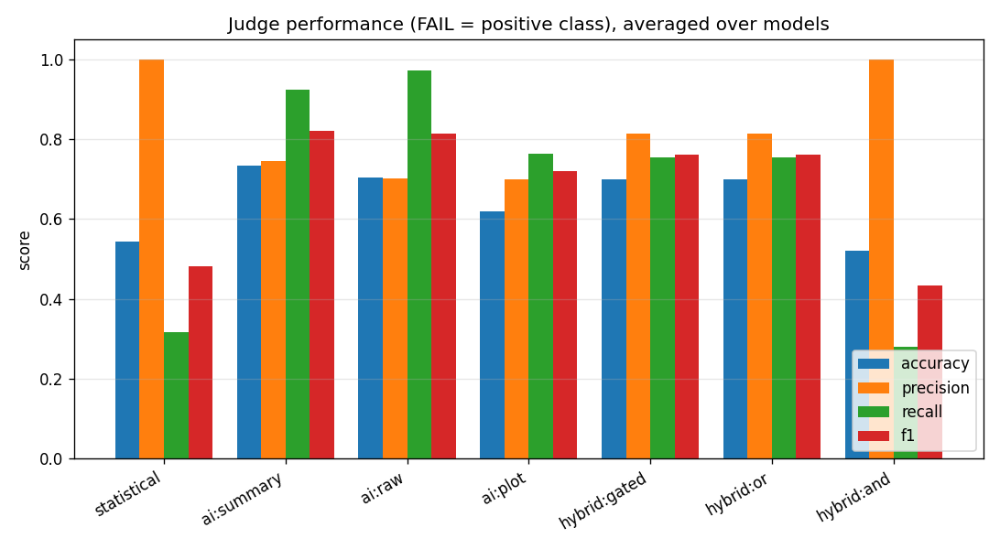
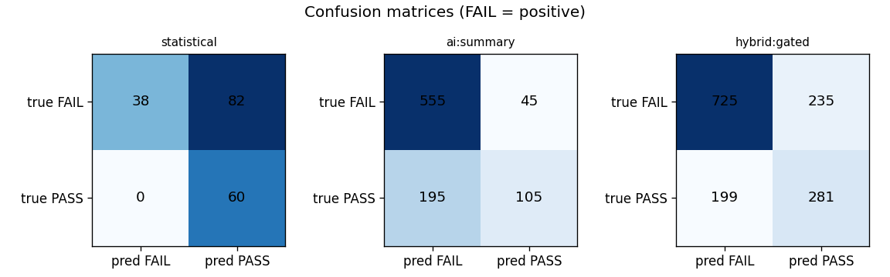

# kayenta-ai-canary-judge — scored judge experiment (results)

_Generated 2026-06-21T23:12:59Z · 180 scenarios (9 families × n=20) · 304.8 min._

## Setup
- **Dataset**: 9 families × 20 instances = 180 labelled scenarios, master seed 20260621, deterministic.
- **Models present**: qwen-llm, phi4-llm, olmo2-llm, mistral-nemo-llm, deepseek-r1-llm, moondream-vlm, granite-vision-vlm, minicpm-v-vlm.
- **Statistical config (uniform, best-practice)**: direction=increase, effectSize=meanRatio (allowedIncrease 1.05 / criticalIncrease 1.25), nanStrategy=remove, outliers=keep, critical=true, mustHaveData=true; scoreThresholds pass=75/marginal=50.
- **AI prompt**: frozen (v1-frozen-2026-06); temperature 0; structured JSON; determinism preflight on no_change_000/qwen-llm: IDENTICAL ✓ (PASS(95.0) vs PASS(95.0)).

## Scoreboard (Table 5) — accuracy / precision / recall / F1, FAIL = positive

| judge | model | acc | prec | recall | F1 | FPR | FNR |
|---|---|---|---|---|---|---|---|
| statistical | - | 0.54 | 1.00 | 0.32 | 0.48 | 0.00 | 0.68 |
| ai:summary | deepseek-r1-llm | 0.73 | 0.72 | 0.97 | 0.83 | 0.77 | 0.03 |
| ai:summary | mistral-nemo-llm | 0.74 | 0.80 | 0.82 | 0.81 | 0.42 | 0.18 |
| ai:summary | olmo2-llm | 0.67 | 0.67 | 1.00 | 0.80 | 1.00 | 0.00 |
| ai:summary | phi4-llm | 0.83 | 0.81 | 0.97 | 0.89 | 0.45 | 0.03 |
| ai:summary | qwen-llm | 0.70 | 0.74 | 0.86 | 0.79 | 0.62 | 0.14 |
| ai:raw | deepseek-r1-llm | 0.73 | 0.71 | 0.99 | 0.83 | 0.80 | 0.01 |
| ai:raw | mistral-nemo-llm | 0.76 | 0.76 | 0.94 | 0.84 | 0.60 | 0.06 |
| ai:raw | olmo2-llm | 0.67 | 0.67 | 1.00 | 0.80 | 1.00 | 0.00 |
| ai:raw | phi4-llm | 0.69 | 0.69 | 1.00 | 0.81 | 0.92 | 0.00 |
| ai:raw | qwen-llm | 0.67 | 0.69 | 0.93 | 0.79 | 0.85 | 0.07 |
| ai:plot | granite-vision-vlm | 0.66 | 0.67 | 0.97 | 0.79 | 0.97 | 0.03 |
| ai:plot | minicpm-v-vlm | 0.60 | 0.72 | 0.65 | 0.68 | 0.50 | 0.35 |
| ai:plot | moondream-vlm | 0.59 | 0.71 | 0.67 | 0.69 | 0.55 | 0.33 |
| hybrid:gated | deepseek-r1-llm | 0.76 | 0.78 | 0.88 | 0.83 | 0.50 | 0.12 |
| hybrid:gated | granite-vision-vlm | 0.64 | 1.00 | 0.46 | 0.63 | 0.00 | 0.54 |
| hybrid:gated | minicpm-v-vlm | 0.65 | 0.79 | 0.65 | 0.71 | 0.35 | 0.35 |
| hybrid:gated | mistral-nemo-llm | 0.74 | 0.80 | 0.82 | 0.81 | 0.42 | 0.17 |
| hybrid:gated | moondream-vlm | 0.68 | 0.92 | 0.57 | 0.71 | 0.10 | 0.42 |
| hybrid:gated | olmo2-llm | 0.67 | 0.67 | 1.00 | 0.80 | 1.00 | 0.00 |
| hybrid:gated | phi4-llm | 0.75 | 0.83 | 0.79 | 0.81 | 0.33 | 0.21 |
| hybrid:gated | qwen-llm | 0.70 | 0.74 | 0.86 | 0.79 | 0.62 | 0.14 |
| hybrid:or | deepseek-r1-llm | 0.76 | 0.78 | 0.88 | 0.83 | 0.50 | 0.12 |
| hybrid:or | granite-vision-vlm | 0.64 | 1.00 | 0.46 | 0.63 | 0.00 | 0.54 |
| hybrid:or | minicpm-v-vlm | 0.65 | 0.79 | 0.65 | 0.71 | 0.35 | 0.35 |
| hybrid:or | mistral-nemo-llm | 0.74 | 0.80 | 0.82 | 0.81 | 0.42 | 0.17 |
| hybrid:or | moondream-vlm | 0.68 | 0.92 | 0.57 | 0.71 | 0.10 | 0.42 |
| hybrid:or | olmo2-llm | 0.67 | 0.67 | 1.00 | 0.80 | 1.00 | 0.00 |
| hybrid:or | phi4-llm | 0.75 | 0.83 | 0.79 | 0.81 | 0.33 | 0.21 |
| hybrid:or | qwen-llm | 0.70 | 0.74 | 0.86 | 0.79 | 0.62 | 0.14 |
| hybrid:and | deepseek-r1-llm | 0.54 | 1.00 | 0.31 | 0.47 | 0.00 | 0.69 |
| hybrid:and | granite-vision-vlm | 0.54 | 1.00 | 0.32 | 0.48 | 0.00 | 0.68 |
| hybrid:and | minicpm-v-vlm | 0.47 | 1.00 | 0.21 | 0.34 | 0.00 | 0.79 |
| hybrid:and | mistral-nemo-llm | 0.54 | 1.00 | 0.31 | 0.47 | 0.00 | 0.69 |
| hybrid:and | moondream-vlm | 0.43 | 1.00 | 0.15 | 0.26 | 0.00 | 0.85 |
| hybrid:and | olmo2-llm | 0.54 | 1.00 | 0.32 | 0.48 | 0.00 | 0.68 |
| hybrid:and | phi4-llm | 0.54 | 1.00 | 0.32 | 0.48 | 0.00 | 0.68 |
| hybrid:and | qwen-llm | 0.54 | 1.00 | 0.32 | 0.48 | 0.00 | 0.68 |

## Per-family accuracy (Table 6) — averaged over models

| judge | no_change | noise_equivalent | healed_transient | clean_mean_shift | variance_increase | tail_regression | gradual_drift | cross_metric_marginal | subtle_regression |
|---|---|---|---|---|---|---|---|---|---|
| statistical | 1.00 | 1.00 | 1.00 | 1.00 | 0.00 | 0.00 | 0.00 | 0.00 | 0.90 |
| ai:summary | 0.59 | 0.46 | 0.00 | 0.99 | 1.00 | 0.99 | 1.00 | 0.59 | 0.98 |
| ai:raw | 0.40 | 0.10 | 0.00 | 1.00 | 1.00 | 0.99 | 1.00 | 0.90 | 0.95 |
| ai:plot | 0.50 | 0.33 | 0.15 | 0.75 | 0.85 | 0.87 | 0.63 | 0.83 | 0.65 |
| hybrid:gated | 0.81 | 0.70 | 0.25 | 1.00 | 0.71 | 0.87 | 0.66 | 0.36 | 0.93 |
| hybrid:or | 0.81 | 0.70 | 0.25 | 1.00 | 0.71 | 0.87 | 0.66 | 0.36 | 0.93 |
| hybrid:and | 1.00 | 1.00 | 1.00 | 0.90 | 0.00 | 0.00 | 0.00 | 0.00 | 0.78 |

## McNemar (Table 7) — paired correctness, exact two-sided p

| model | judge A | judge B | discordant | A✗B✓ | A✓B✗ | χ²(cc) | p |
|---|---|---|---|---|---|---|---|
| qwen-llm | statistical | ai:summary | 102 | 65 | 37 | 7.1471 | 0.00721 |
| qwen-llm | statistical | hybrid:gated | 102 | 65 | 37 | 7.1471 | 0.00721 |
| qwen-llm | ai:summary | hybrid:gated | 0 | 0 | 0 | 0.0 | 1.0 |
| phi4-llm | statistical | ai:summary | 106 | 79 | 27 | 24.5377 | 0.0 |
| phi4-llm | statistical | hybrid:gated | 77 | 57 | 20 | 16.8312 | 3e-05 |
| phi4-llm | ai:summary | hybrid:gated | 29 | 7 | 22 | 6.7586 | 0.00813 |
| olmo2-llm | statistical | ai:summary | 142 | 82 | 60 | 3.1056 | 0.07765 |
| olmo2-llm | statistical | hybrid:gated | 142 | 82 | 60 | 3.1056 | 0.07765 |
| olmo2-llm | ai:summary | hybrid:gated | 0 | 0 | 0 | 0.0 | 1.0 |
| mistral-nemo-llm | statistical | ai:summary | 87 | 61 | 26 | 13.2874 | 0.00022 |
| mistral-nemo-llm | statistical | hybrid:gated | 86 | 61 | 25 | 14.2442 | 0.00013 |
| mistral-nemo-llm | ai:summary | hybrid:gated | 1 | 1 | 0 | 0.0 | 1.0 |
| deepseek-r1-llm | statistical | ai:summary | 127 | 80 | 47 | 8.063 | 0.00433 |
| deepseek-r1-llm | statistical | hybrid:gated | 98 | 68 | 30 | 13.9694 | 0.00016 |
| deepseek-r1-llm | ai:summary | hybrid:gated | 29 | 17 | 12 | 0.5517 | 0.45826 |
| moondream-vlm | statistical | ai:plot | 115 | 62 | 53 | 0.5565 | 0.45581 |
| moondream-vlm | statistical | hybrid:gated | 37 | 31 | 6 | 15.5676 | 4e-05 |
| moondream-vlm | ai:plot | hybrid:gated | 78 | 47 | 31 | 2.8846 | 0.08878 |
| granite-vision-vlm | statistical | ai:plot | 137 | 79 | 58 | 2.9197 | 0.08713 |
| granite-vision-vlm | statistical | hybrid:gated | 17 | 17 | 0 | 15.0588 | 2e-05 |
| granite-vision-vlm | ai:plot | hybrid:gated | 120 | 58 | 62 | 0.075 | 0.78433 |
| minicpm-v-vlm | statistical | ai:plot | 96 | 53 | 43 | 0.8438 | 0.3584 |
| minicpm-v-vlm | statistical | hybrid:gated | 61 | 40 | 21 | 5.3115 | 0.02041 |
| minicpm-v-vlm | ai:plot | hybrid:gated | 35 | 22 | 13 | 1.8286 | 0.17547 |

## Figures
- 
- 
- 

## Interpretation (auto-generated)

- **Statistical (NetflixACAJudge)** overall accuracy 0.54.
- On the structural blind-spot families it is weak: variance_increase 0%, tail_regression 0%, gradual_drift 0%, cross_metric_marginal 0% (median/rank test is blind to variance, tails, temporal order and cross-metric dilution).
- **ai:summary** blind-spot accuracy (avg over models & those families): 0.90.
- **ai:raw** blind-spot accuracy (avg over models & those families): 0.97.
- **ai:plot** blind-spot accuracy (avg over models & those families): 0.80.
- **hybrid:gated** overall accuracy (avg over models): 0.70.
- **hybrid:or** overall accuracy (avg over models): 0.70.
- **hybrid:and** overall accuracy (avg over models): 0.52.
- **Best judge family overall (by mean accuracy over models): `ai:summary`** (0.73).
- Per-family winner: no_change→statistical(100%), noise_equivalent→statistical(100%), healed_transient→statistical(100%), clean_mean_shift→statistical(100%), variance_increase→ai:raw(100%), tail_regression→ai:raw(99%), gradual_drift→ai:raw(100%), cross_metric_marginal→ai:raw(90%), subtle_regression→ai:summary(98%).

> FAIL families with genuine PASS counterparts make these numbers meaningful: a judge that always says FAIL is penalised on `no_change`/`noise_equivalent`/`healed_transient`.
