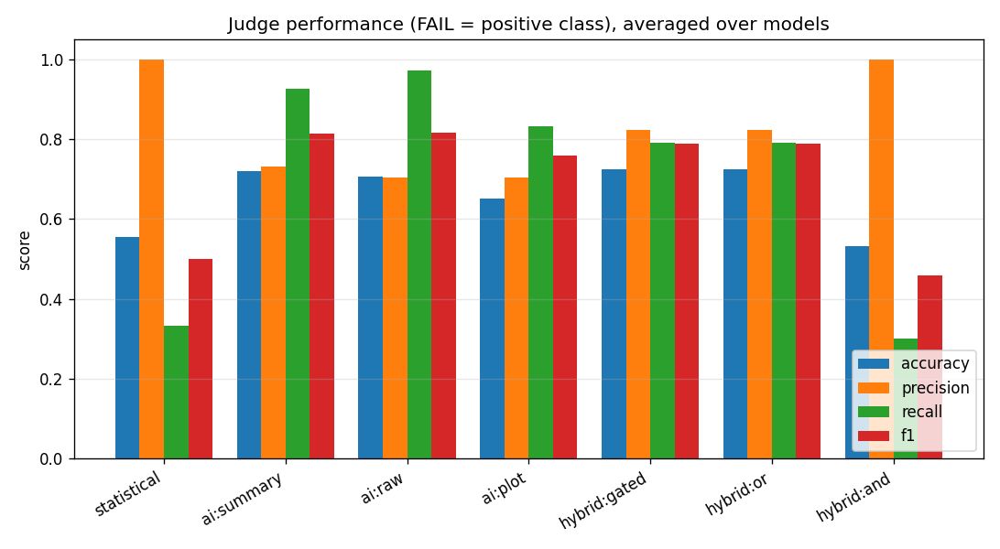
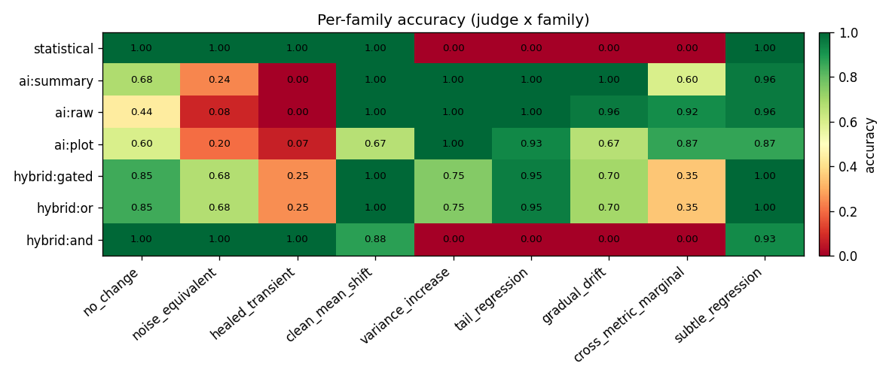
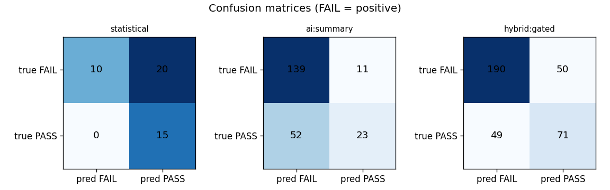

# kayenta-ai-canary-judge — scored judge experiment (results)

_Generated 2026-06-21T17:56:21Z · 45 scenarios (9 families × n=5) · 77.2 min._

## Setup
- **Dataset**: 9 families × 5 instances = 45 labelled scenarios, master seed 20260621, deterministic.
- **Models present**: qwen-llm, phi4-llm, olmo2-llm, mistral-nemo-llm, deepseek-r1-llm, moondream-vlm, granite-vision-vlm, minicpm-v-vlm.
- **Statistical config (uniform, best-practice)**: direction=increase, effectSize=meanRatio (allowedIncrease 1.05 / criticalIncrease 1.25), nanStrategy=remove, outliers=keep, critical=true, mustHaveData=true; scoreThresholds pass=75/marginal=50.
- **AI prompt**: frozen (v1-frozen-2026-06); temperature 0; structured JSON; determinism preflight on no_change_000/qwen-llm: IDENTICAL ✓ (PASS(95.0) vs PASS(95.0)).

## Scoreboard (Table 5) — accuracy / precision / recall / F1, FAIL = positive

| judge | model | acc | prec | recall | F1 | FPR | FNR |
|---|---|---|---|---|---|---|---|
| statistical | - | 0.56 | 1.00 | 0.33 | 0.50 | 0.00 | 0.67 |
| ai:summary | deepseek-r1-llm | 0.71 | 0.71 | 0.97 | 0.82 | 0.80 | 0.03 |
| ai:summary | mistral-nemo-llm | 0.71 | 0.76 | 0.83 | 0.79 | 0.53 | 0.17 |
| ai:summary | olmo2-llm | 0.67 | 0.67 | 1.00 | 0.80 | 1.00 | 0.00 |
| ai:summary | phi4-llm | 0.78 | 0.76 | 0.97 | 0.85 | 0.60 | 0.03 |
| ai:summary | qwen-llm | 0.73 | 0.76 | 0.87 | 0.81 | 0.53 | 0.13 |
| ai:raw | deepseek-r1-llm | 0.67 | 0.68 | 0.93 | 0.79 | 0.87 | 0.07 |
| ai:raw | mistral-nemo-llm | 0.80 | 0.78 | 0.97 | 0.87 | 0.53 | 0.03 |
| ai:raw | olmo2-llm | 0.67 | 0.67 | 1.00 | 0.80 | 1.00 | 0.00 |
| ai:raw | phi4-llm | 0.71 | 0.70 | 1.00 | 0.82 | 0.87 | 0.00 |
| ai:raw | qwen-llm | 0.69 | 0.69 | 0.97 | 0.81 | 0.87 | 0.03 |
| ai:plot | granite-vision-vlm | 0.67 | 0.67 | 0.97 | 0.79 | 0.93 | 0.03 |
| ai:plot | minicpm-v-vlm | 0.62 | 0.71 | 0.73 | 0.72 | 0.60 | 0.27 |
| ai:plot | moondream-vlm | 0.67 | 0.73 | 0.80 | 0.76 | 0.60 | 0.20 |
| hybrid:gated | deepseek-r1-llm | 0.78 | 0.79 | 0.90 | 0.84 | 0.47 | 0.10 |
| hybrid:gated | granite-vision-vlm | 0.67 | 1.00 | 0.50 | 0.67 | 0.00 | 0.50 |
| hybrid:gated | minicpm-v-vlm | 0.64 | 0.77 | 0.67 | 0.71 | 0.40 | 0.33 |
| hybrid:gated | mistral-nemo-llm | 0.71 | 0.76 | 0.83 | 0.79 | 0.53 | 0.17 |
| hybrid:gated | moondream-vlm | 0.82 | 1.00 | 0.73 | 0.85 | 0.00 | 0.27 |
| hybrid:gated | olmo2-llm | 0.67 | 0.67 | 1.00 | 0.80 | 1.00 | 0.00 |
| hybrid:gated | phi4-llm | 0.78 | 0.83 | 0.83 | 0.83 | 0.33 | 0.17 |
| hybrid:gated | qwen-llm | 0.73 | 0.76 | 0.87 | 0.81 | 0.53 | 0.13 |
| hybrid:or | deepseek-r1-llm | 0.78 | 0.79 | 0.90 | 0.84 | 0.47 | 0.10 |
| hybrid:or | granite-vision-vlm | 0.67 | 1.00 | 0.50 | 0.67 | 0.00 | 0.50 |
| hybrid:or | minicpm-v-vlm | 0.64 | 0.77 | 0.67 | 0.71 | 0.40 | 0.33 |
| hybrid:or | mistral-nemo-llm | 0.71 | 0.76 | 0.83 | 0.79 | 0.53 | 0.17 |
| hybrid:or | moondream-vlm | 0.82 | 1.00 | 0.73 | 0.85 | 0.00 | 0.27 |
| hybrid:or | olmo2-llm | 0.67 | 0.67 | 1.00 | 0.80 | 1.00 | 0.00 |
| hybrid:or | phi4-llm | 0.78 | 0.83 | 0.83 | 0.83 | 0.33 | 0.17 |
| hybrid:or | qwen-llm | 0.73 | 0.76 | 0.87 | 0.81 | 0.53 | 0.13 |
| hybrid:and | deepseek-r1-llm | 0.53 | 1.00 | 0.30 | 0.46 | 0.00 | 0.70 |
| hybrid:and | granite-vision-vlm | 0.53 | 1.00 | 0.30 | 0.46 | 0.00 | 0.70 |
| hybrid:and | minicpm-v-vlm | 0.53 | 1.00 | 0.30 | 0.46 | 0.00 | 0.70 |
| hybrid:and | mistral-nemo-llm | 0.56 | 1.00 | 0.33 | 0.50 | 0.00 | 0.67 |
| hybrid:and | moondream-vlm | 0.44 | 1.00 | 0.17 | 0.29 | 0.00 | 0.83 |
| hybrid:and | olmo2-llm | 0.56 | 1.00 | 0.33 | 0.50 | 0.00 | 0.67 |
| hybrid:and | phi4-llm | 0.56 | 1.00 | 0.33 | 0.50 | 0.00 | 0.67 |
| hybrid:and | qwen-llm | 0.56 | 1.00 | 0.33 | 0.50 | 0.00 | 0.67 |

## Per-family accuracy (Table 6) — averaged over models

| judge | no_change | noise_equivalent | healed_transient | clean_mean_shift | variance_increase | tail_regression | gradual_drift | cross_metric_marginal | subtle_regression |
|---|---|---|---|---|---|---|---|---|---|
| statistical | 1.00 | 1.00 | 1.00 | 1.00 | 0.00 | 0.00 | 0.00 | 0.00 | 1.00 |
| ai:summary | 0.68 | 0.24 | 0.00 | 1.00 | 1.00 | 1.00 | 1.00 | 0.60 | 0.96 |
| ai:raw | 0.44 | 0.08 | 0.00 | 1.00 | 1.00 | 1.00 | 0.96 | 0.92 | 0.96 |
| ai:plot | 0.60 | 0.20 | 0.07 | 0.67 | 1.00 | 0.93 | 0.67 | 0.87 | 0.87 |
| hybrid:gated | 0.85 | 0.68 | 0.25 | 1.00 | 0.75 | 0.95 | 0.70 | 0.35 | 1.00 |
| hybrid:or | 0.85 | 0.68 | 0.25 | 1.00 | 0.75 | 0.95 | 0.70 | 0.35 | 1.00 |
| hybrid:and | 1.00 | 1.00 | 1.00 | 0.88 | 0.00 | 0.00 | 0.00 | 0.00 | 0.93 |

## McNemar (Table 7) — paired correctness, exact two-sided p

| model | judge A | judge B | discordant | A✗B✓ | A✓B✗ | χ²(cc) | p |
|---|---|---|---|---|---|---|---|
| qwen-llm | statistical | ai:summary | 24 | 16 | 8 | 2.0417 | 0.15159 |
| qwen-llm | statistical | hybrid:gated | 24 | 16 | 8 | 2.0417 | 0.15159 |
| qwen-llm | ai:summary | hybrid:gated | 0 | 0 | 0 | 0.0 | 1.0 |
| phi4-llm | statistical | ai:summary | 28 | 19 | 9 | 2.8929 | 0.08716 |
| phi4-llm | statistical | hybrid:gated | 20 | 15 | 5 | 4.05 | 0.04139 |
| phi4-llm | ai:summary | hybrid:gated | 8 | 4 | 4 | 0.125 | 1.0 |
| olmo2-llm | statistical | ai:summary | 35 | 20 | 15 | 0.4571 | 0.49956 |
| olmo2-llm | statistical | hybrid:gated | 35 | 20 | 15 | 0.4571 | 0.49956 |
| olmo2-llm | ai:summary | hybrid:gated | 0 | 0 | 0 | 0.0 | 1.0 |
| mistral-nemo-llm | statistical | ai:summary | 23 | 15 | 8 | 1.5652 | 0.21004 |
| mistral-nemo-llm | statistical | hybrid:gated | 23 | 15 | 8 | 1.5652 | 0.21004 |
| mistral-nemo-llm | ai:summary | hybrid:gated | 0 | 0 | 0 | 0.0 | 1.0 |
| deepseek-r1-llm | statistical | ai:summary | 33 | 20 | 13 | 1.0909 | 0.29621 |
| deepseek-r1-llm | statistical | hybrid:gated | 24 | 17 | 7 | 3.375 | 0.06391 |
| deepseek-r1-llm | ai:summary | hybrid:gated | 9 | 6 | 3 | 0.4444 | 0.50781 |
| moondream-vlm | statistical | ai:plot | 33 | 19 | 14 | 0.4848 | 0.48685 |
| moondream-vlm | statistical | hybrid:gated | 12 | 12 | 0 | 10.0833 | 0.00049 |
| moondream-vlm | ai:plot | hybrid:gated | 21 | 14 | 7 | 1.7143 | 0.18925 |
| granite-vision-vlm | statistical | ai:plot | 35 | 20 | 15 | 0.4571 | 0.49956 |
| granite-vision-vlm | statistical | hybrid:gated | 5 | 5 | 0 | 3.2 | 0.0625 |
| granite-vision-vlm | ai:plot | hybrid:gated | 30 | 15 | 15 | 0.0333 | 1.0 |
| minicpm-v-vlm | statistical | ai:plot | 23 | 13 | 10 | 0.1739 | 0.67764 |
| minicpm-v-vlm | statistical | hybrid:gated | 16 | 10 | 6 | 0.5625 | 0.4545 |
| minicpm-v-vlm | ai:plot | hybrid:gated | 7 | 4 | 3 | 0.0 | 1.0 |

## Figures
- 
- 
- 

## Interpretation (auto-generated)

- **Statistical (NetflixACAJudge)** overall accuracy 0.56.
- On the structural blind-spot families it is weak: variance_increase 0%, tail_regression 0%, gradual_drift 0%, cross_metric_marginal 0% (median/rank test is blind to variance, tails, temporal order and cross-metric dilution).
- **ai:summary** blind-spot accuracy (avg over models & those families): 0.90.
- **ai:raw** blind-spot accuracy (avg over models & those families): 0.97.
- **ai:plot** blind-spot accuracy (avg over models & those families): 0.87.
- **hybrid:gated** overall accuracy (avg over models): 0.72.
- **hybrid:or** overall accuracy (avg over models): 0.72.
- **hybrid:and** overall accuracy (avg over models): 0.53.
- **Best judge family overall (by mean accuracy over models): `hybrid:gated`** (0.72).
- Per-family winner: no_change→hybrid:and(100%), noise_equivalent→hybrid:and(100%), healed_transient→hybrid:and(100%), clean_mean_shift→ai:raw(100%), variance_increase→ai:raw(100%), tail_regression→ai:raw(100%), gradual_drift→ai:summary(100%), cross_metric_marginal→ai:raw(92%), subtle_regression→hybrid:gated(100%).

> FAIL families with genuine PASS counterparts make these numbers meaningful: a judge that always says FAIL is penalised on `no_change`/`noise_equivalent`/`healed_transient`.
